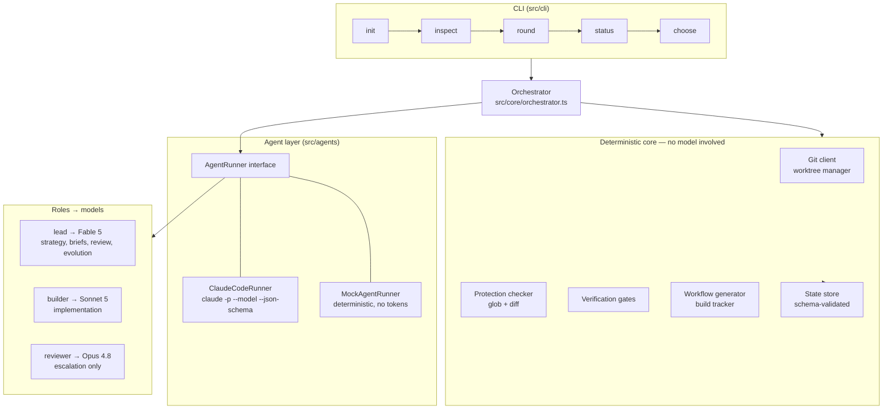
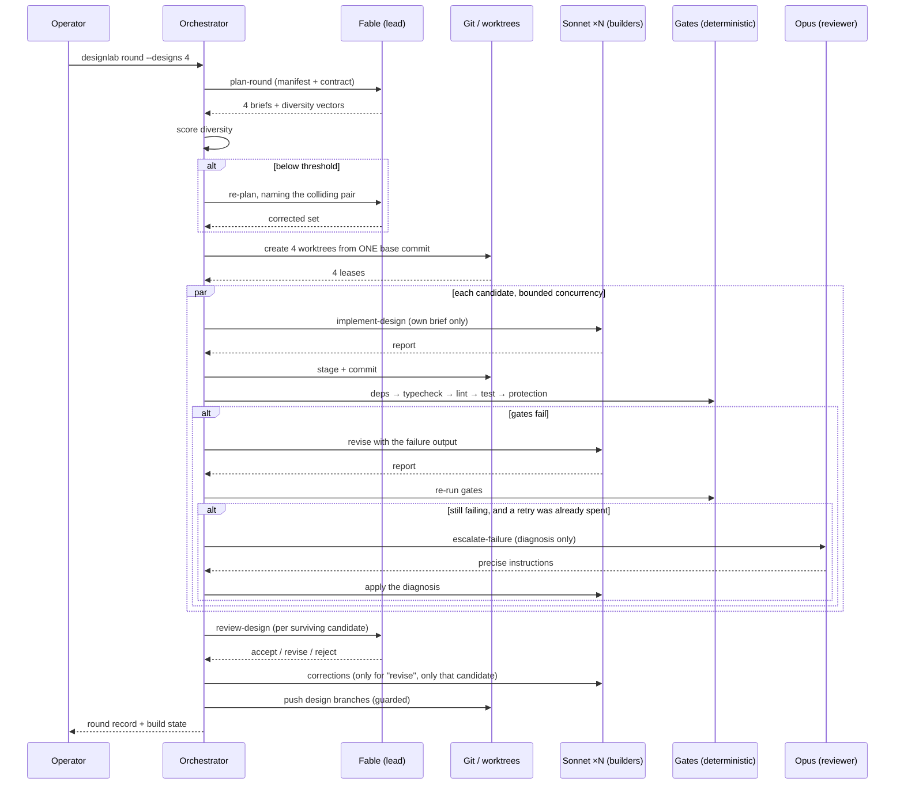
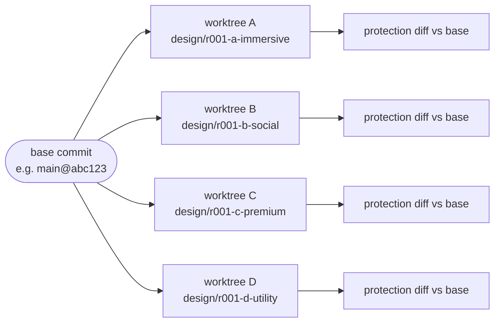

# Architecture

## Design principle

DesignLab's job is to run many risky, expensive, parallel experiments on
somebody's working application and to be trustworthy about the results. Two
consequences shape everything below.

**Deterministic enforcement over instructions.** Anywhere a guarantee could be
enforced either by asking a model to behave or by making misbehaviour
impossible, DesignLab does the latter. Protection is a Git diff. Isolation is a
worktree lease. "Tests passed" is an exit code. A model that ignores its
instructions fails a gate; it does not quietly ship.

**Honest reporting over optimistic reporting.** Every state that could be
inferred optimistically is instead derived from evidence: a gate that was
skipped is `skipped`, never `passed`; a build is `BUILD_SUCCESS` only when the
GitHub Actions API returns an artifact.

---

## System overview



---

## Module map

| Directory | Responsibility |
| --- | --- |
| `src/core` | Schemas, state store, orchestrator, logger, errors, exec, ids, paths |
| `src/config` | Config schema, layering (defaults → file → env → flags) |
| `src/git` | Git client and worktree manager (isolation guarantees) |
| `src/agents` | Runner abstraction, Claude Code runner, deterministic runner, prompts, usage ledger |
| `src/analysis` | Repository inspection, framework/capability detection, App Manifest |
| `src/protection` | Functionality Contract construction, glob matcher, diff checker |
| `src/design` | Round planning, diversity scoring, candidate builder, design review |
| `src/testing` | Verification gate pipeline |
| `src/builds` | Actions workflow adapters, build state tracking |
| `src/lineage` | Winner selection, feedback parsing, next-generation planning |
| `src/cli` | Commands, context resolution, output formatting |

---

## Round execution



### Why the escalation ladder has that shape

Opus is never invoked speculatively and never on a first failure. Most builder
failures are ordinary — a missing import after a component rename, a stale
snapshot — and Sonnet fixes them from the gate output alone. Escalation costs
are only worth paying when a builder has demonstrated it cannot see the
problem, so the condition is: a retry has already been spent, another remains,
and the failure was not a protection violation (a protection failure is a
design decision to reverse, not an engineering puzzle to solve).

---

## Isolation model



Enforced properties:

- Every candidate branches from the **identical** commit, so comparison is
  meaningful and no candidate inherits another's work.
- A builder receives a **lease** naming exactly one directory. The lease is
  re-verified immediately before dispatch, and `assertWithinLease` rejects any
  path outside it.
- Design branches are **never merged** — not into each other, not into the
  base. The orchestrator has no merge path at all.
- Pushing goes through `assertPushSafe`, which refuses protected branches and
  refuses any branch not carrying the configured design prefix.
- `git worktree add/remove` mutate shared metadata under `.git/worktrees/` and
  Git does not lock that directory against itself, so the manager serialises
  its own mutations internally. Callers may fan out freely.

---

## Model boundary

Everything crossing the model boundary is schema-shaped in both directions.

Requests carry a role, an operation name, a prompt, a working directory, a
tool policy, and — for every structured stage — a Zod schema converted to JSON
Schema and passed to `claude --json-schema`. Responses are validated before
DesignLab looks at them, so a malformed answer is a typed failure rather than a
crash three layers later.

That uniformity is what makes `MockAgentRunner` viable: it synthesises
schema-valid answers, which lets the *production* orchestrator run end to end
with zero tokens. `--dry-run` and the integration suite both use it, so the
tests exercise the real pipeline.

### Why the Claude Code CLI rather than an API client

The CLI is the officially supported headless surface (`-p`, `--model`,
`--output-format json`, `--json-schema`, `--allowedTools`,
`--permission-mode`, `--max-budget-usd`). Using it means DesignLab inherits the
operator's existing authentication and model access, gains structured output
without hand-rolling retry-on-malformed-JSON, and does not need updating when
new models ship — roles map to aliases (`fable`, `sonnet`, `opus`) that the CLI
resolves.

The runner tolerates envelope drift: it reads documented fields when present
and falls back to treating stdout as text otherwise, so a CLI upgrade degrades
output fidelity rather than breaking the pipeline.

---

## State

```
.designlab/
├── schemas/                      JSON Schemas for every persisted document
├── state/projects/<projectId>/
│   ├── project.json
│   ├── manifests/<sha>.json      keyed by inspected commit → the cache
│   ├── manifests/latest.json
│   ├── analysis/<sha>.md         human-readable
│   ├── contract.json
│   ├── lineage.json
│   └── rounds/<roundId>/
│       ├── round.json            candidates, gates, reviews, builds
│       ├── briefs/<slot>.json
│       ├── logs/<slot>/…         builder transcripts
│       └── next-generation-plan.json
├── workspace/<projectId>/
│   ├── repo/                     the working clone
│   └── worktrees/<name>/         one per candidate
└── usage.jsonl                   model/agent usage ledger
```

Reads validate against the schema; a hand-edited or version-mismatched file
fails with `STATE_CORRUPT` rather than silently poisoning a round. Writes are
atomic (temp file + rename), because rounds persist while builders are still
running.

`workspace/` is disposable and rebuilt on demand. `state/` holds the round
history and lineage.

---

## Concurrency

Candidates run at `limits.concurrency` in parallel. Three details make that
safe:

1. The orchestrator keeps **one** mutable `candidates` array for the whole
   round. Persisting writes a snapshot; it never rebinds the array. Rebinding
   would orphan an in-flight builder's object and silently discard its result.
2. State is persisted after every candidate completes, so a crash mid-round
   loses at most one candidate's progress.
3. A candidate that throws is caught, marked `failed`, and does not abort its
   siblings — a round returning three good designs beats one returning none.

---

## Extension points

| To add | Implement |
| --- | --- |
| A different model backend | `AgentRunner` in `src/agents/types.ts` |
| Support for another framework | A detector in `src/analysis/detectors.ts` |
| Another Android build system | A generator in `src/builds/workflow-generator.ts` |
| A different CI provider | `ActionsClient` in `src/builds/build-tracker.ts` |
| Project-specific protection | `protection.rules` in `designlab.config.json` |
| A dashboard | Consume the library surface in `src/index.ts` |
